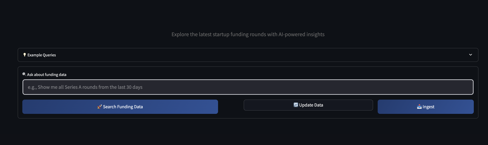
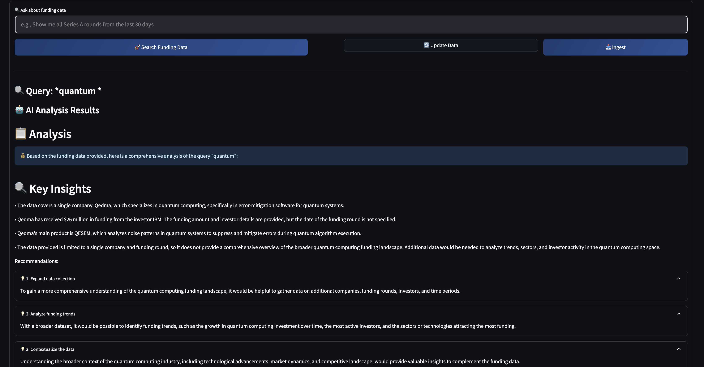

# 💰 Funding Intelligence RAG

A comprehensive RAG (Retrieval-Augmented Generation) system for analyzing startup funding data with AI-powered insights.


<figure>
  
  <figcaption><strong>Figure 1:</strong> Home screen of the Funding Intelligence RAG Streamlit app.</figcaption>
</figure>

## ✨ Features

- 🕷️ **Web Scraping**: Automated scraping of TechCrunch funding articles
- 🤖 **AI-Powered Analysis**: Smart funding insights using OpenRouter API
- 🧠 **RAG System**: Intelligent query system with ChromaDB vectorization for funding data retrieval
- 🌐 **Streamlit Interface**: Interactive web app for querying funding data with AI reasoning
- 📊 **MongoDB Integration**: Scalable database storage for funding data

## 📁 Project Structure

### 🎯 Main Application
- `app.py` - 🎨 Streamlit RAG interface for querying funding data

<figure>
  
  <figcaption><strong>Figure 2:</strong> Example of AI-powered funding query results.</figcaption>
</figure>


### 🛠️ Services (`/services/`)
- `data_service.py` - 🧠 Core RAG service with ChromaDB and LLM reasoning
- `scraper_service.py` - 🕷️ TechCrunch scraper with AI enhancement
- `article_processor.py` - 📝 Article content processing and funding data extraction
- `database.py` - 🗄️ MongoDB database operations and schema management

### 🤖 AI Agents (`/services/agents/`)
- `agent_007.py` - 🎯 AI agent for classifying funding articles using OpenRouter API
- `agent_data_struct.py` - 🧠 AI agent for extracting structured funding data
- `agent_rag.py` - 🤖 RAG agent for LLM reasoning and response generation

### 🎨 UI Components (`/ui/`)
- `components.py` - 🖼️ Reusable Streamlit UI components
- `styles.py` - 🎨 Custom CSS styling for the interface

### ⚙️ Configuration (`/config/`)
- `settings.py` - 🔧 Application configuration and API settings

## 🚀 Setup

1. **Install dependencies:**
```bash
pip install streamlit pandas scikit-learn beautifulsoup4 requests numpy pymongo chromadb
```

2. **Set OpenRouter API key for AI enhancement:**
```bash
export OPENROUTER_API_KEY=your_api_key_here
```

3. **Set MongoDB connection (optional):**
```bash
export MONGODB_URI=mongodb://localhost:27017/
```

## 🎮 Usage

### 🎨 Run the RAG Interface
```bash
streamlit run app.py
```

## 🔧 Key Components

- **🎯 Smart Analysis**: AI-powered funding insights with reasoning
- **🔍 Vector Search**: ChromaDB vectorization for relevant funding round retrieval  
- **⚡ Real-time Scraping**: Live data collection from TechCrunch funding articles
- **🤖 LLM Integration**: OpenRouter API integration for intelligent analysis
- **📊 Database Integration**: MongoDB storage with comprehensive schema
